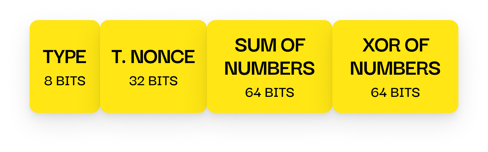
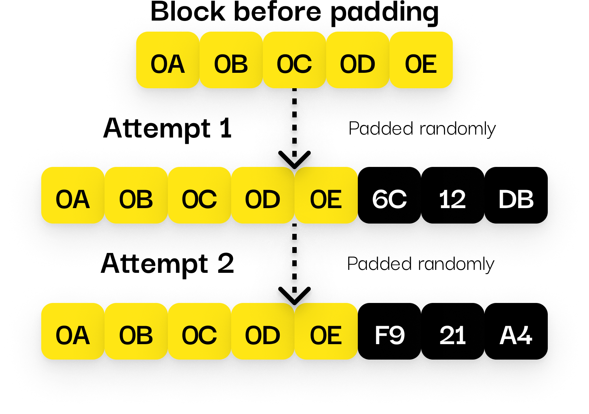

<p align="center">
  
</p>

<h1 align="center">Lightweight Secure TCP</h1>
<p align="center"><em>"Just like its name!"  — lightweight & secure.</em></p>

## 🌐 Overview

Lightweight Secure TCP is a minimal, fast, dependency-free communication layer built on plain TCP, enhanced with encryption and lightweight protocol rules.  
It is ideal for secure communication between devices and systems, including embedded platforms like ESP32.

> Requires a C++17-compatible compiler and standard library

## ⚡ Features

- ✅ Encrypted handshake + encrypted messaging
- ✅ No external dependencies
- ✅ Cross-platform: Linux, Windows, macOS, Qt, ESP32
- ✅ Supports Keep-Alive, graceful disconnect, and message acknowledgment
- ✅ CMake and PlatformIO compatible
- ✅ Fully documented and tested

## 🔐 How Handshake Works

Each connection starts with a secure challenge–response handshake.
Client must calculate the correct result using the shared secret key:



## 🧩 Randomized Padding

Even if the same message is sent twice, the encrypted result will differ.
This is achieved by randomized padding inside each packet:



## 🚀 Getting Started

### 🧩 Step 1 — Download the Repository

Clone (or download) the repository:

```bash
git clone https://github.com/sDenizOzturk/lightweight-secure-tcp.git
```

Copy the `lib` folder into your project:

```bash
cp -r lightweight-secure-tcp/lib/LightweightSecureTCP/ your-project/lib/
```

### 📁 Step 2 — Organize Your Project Folder

Place the folder like this:

```
your-project/
├── lib/
│   └── LightweightSecureTCP/
├── src/
│   └── main.cpp
├── CMakeLists.txt
```

If you're using **PlatformIO**, you're done.  
If you're using **CMake** on desktop platforms, proceed to Step 3.

## ⚙️ Step 3 — Modify `CMakeLists.txt`

Add the following lines to your `CMakeLists.txt`:

```cmake
add_subdirectory(lib/LightweightSecureTCP)

target_link_libraries(your_target PRIVATE LightweightSecureTCP)
```

> Replace `your_target` with the name of your executable or application target.

### ✅ That’s All

LightweightSecureTCP is now part of your project.  
No additional setup or external dependencies are required.

## 🧪 Tests

Run all tests via:

```bash
./test_runner
```

Tests are located under `tests/`.
You are encouraged to contribute more cases!

## 📄 Documentation

Extensive documentation is available online. It includes usage examples, protocol internals, and integration guides.

👉 **Explore the full docs:**  
[📘 sDenizOzturk.github.io/lightweight-secure-tcp »](https://sDenizOzturk.github.io/lightweight-secure-tcp)

You’ll find:

- Step-by-step usage instructions
- Protocol design and packet formats
- ESP32 and Desktop examples
- Encryption and keep-alive mechanisms
- Contribution guide

## 🎞️ Presentation

Want a quick overview of the project?

Check out the [LightweightSecureTCP-presentation.pdf](./assets/LightweightSecureTCP-presentation.pdf)  
It summarizes the key features, architecture, and usage in a visual format.

## 🤝 Contributing

See [Contributing Guide](https://sdenizozturk.github.io/lightweight-secure-tcp/docs/contributing) for instructions.

## 📜 License

[MIT License](./LICENSE) © [sDenizOzturk](https://github.com/sDenizOzturk)
