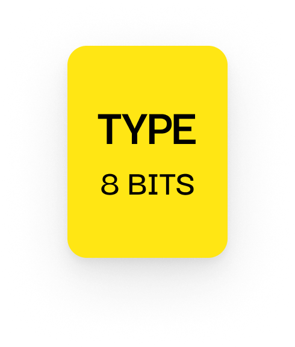

# Disconnect Packet

---

## 📦 Size

1 byte

- `TYPE`: 8 bits (`0x06`)

---

## 📤 Sent By

**Either side (client or server)**, when intentionally closing the connection.

---

## 🧪 Contents

- Contains only the `TYPE` field
- The byte is **not encrypted**

---

## 🧹 Purpose

Used to gracefully shut down an active connection.

- Indicates a clean, expected disconnection (not a timeout or crash)
- Received by the other party to handle teardown cleanly

If no disconnect packet is received and the connection drops, the session is considered aborted or timed out.
