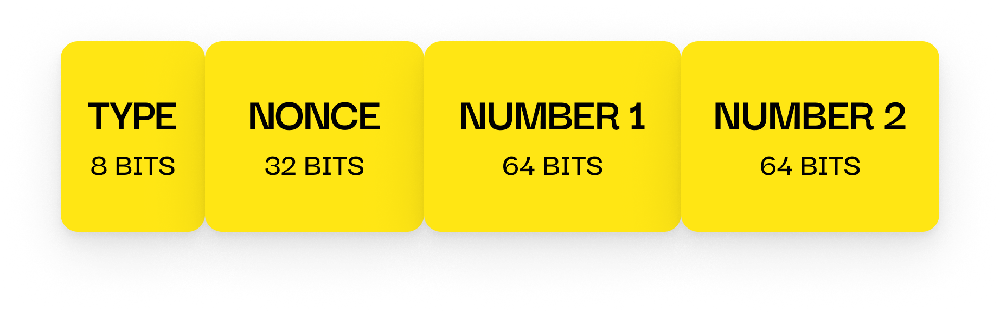

# Handshake Request Packet

---

## 📦 Size

**21 bytes**

- `TYPE`: 8 bits
- `NONCE`: 32 bits
- `NUMBER 1`: 64 bits
- `NUMBER 2`: 64 bits

---

## 📤 Sent By

**Server**, immediately after the client connects to it.

---

## 🧪 Contents

- A random **32-bit nonce**
- Two **64-bit random values**
- The `TYPE` field (`0x02`) is sent **unencrypted**
- All other fields are **encrypted** using the static shared key

---

## 🔒 Purpose

This packet is sent by the server to initiate the handshake process.

It contains random values (nonce, number1, number2) which will be  
used by the server together with the client's response to generate a **unique session key**  
after successful verification.
