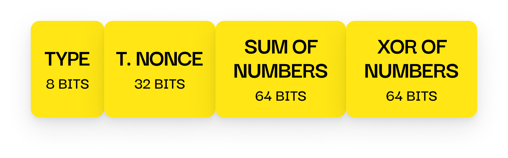

# Handshake Response Packet

---

## 📦 Size

21 bytes

- `TYPE`: 8 bits
- `T. NONCE`: 32 bits (transformed client nonce)
- `SUM OF NUMBERS`: 64 bits
- `XOR OF NUMBERS`: 64 bits

---

## 📤 Sent By

**Client**, in response to a `HandshakeRequest` from the server.

---

## 🧪 Contents

- A **transformed version of the original client nonce**, XOR’ed with parts of the sum and XOR of the numbers sent by the client
- The **sum and XOR** of the challenge numbers the client sent earlier

Only the `TYPE` field (`0x03`) is unencrypted.  
The rest of the packet is encrypted with the **shared handshake key**.

---

## 🔒 Purpose

This packet is sent by the client in response to the server's challenge.

It proves that the client possesses the correct handshake key  
by demonstrating knowledge of the original challenge values (nonce, number1, number2),  
which were encrypted using the shared key.

If the server cannot verify this packet correctly, the handshake fails.
