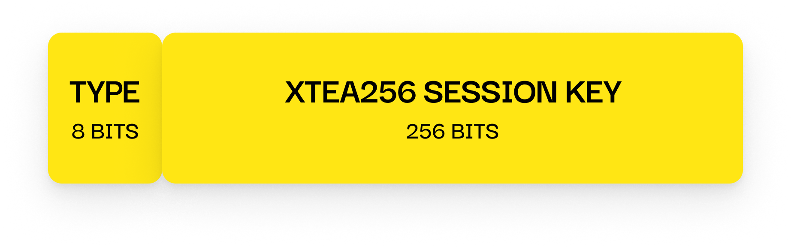

# Handshake Success Packet

---

## 📦 Size

33 bytes

- `TYPE`: 8 bits
- `XTEA256 SESSION KEY`: 256 bits (32 bytes)

---

## 📤 Sent By

**Server**, after successfully verifying the client's handshake response.

---

## 🧪 Contents

- A newly generated **256-bit session key**, used for all future communication
- The `TYPE` field (`0x04`) is unencrypted
- The session key itself is **encrypted** using the static shared key

---

## 🔒 Purpose

This packet finalizes the handshake process by securely sharing  
a newly generated 256-bit session key with the client.

Once the client decrypts this key using the shared handshake key,  
both sides switch to **session-level encryption** for all subsequent communication.

No plaintext content will be transferred after this point.
