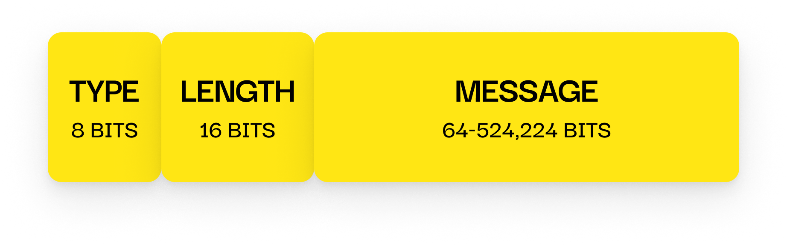

# Regular Message Packet

---

## 📦 Size

**11 – 65,531 bytes**

- `TYPE`: 8 bits
- `LENGTH`: 16 bits (represents the original message length in bytes)
- `MESSAGE`: 64 – 524,224 bits (8 – 65,528 bytes, padded)

The message is padded to the nearest multiple of 8 bytes.

---

## 🔁 Sent By

**Both client and server**, after a session is successfully established.

---

## 🧪 Contents

- `TYPE` field (`0x01`) is unencrypted
- `LENGTH` field indicates the actual message size (before padding)
- The `MESSAGE` field contains:
  - The message string (UTF-8)
  - Random padding
  - All encrypted using the **session key**

---

## 📌 Padding Details

To align with 64-bit (8-byte) encryption blocks, the message is padded with random bytes.  
This padding is stripped automatically after decryption.

---

## 🔒 Purpose

This packet carries actual user data between the server and client.  
All content is encrypted using the session key to ensure confidentiality.
