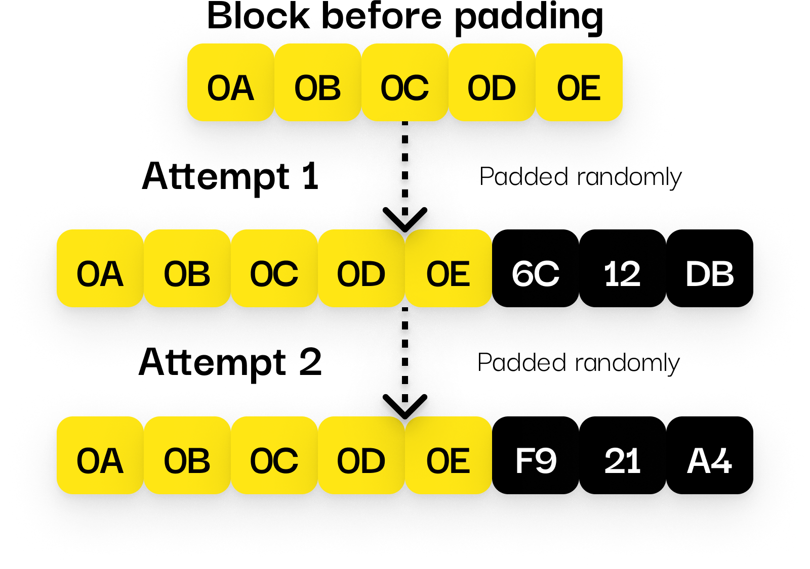

# Randomized Padding

---

## 📦 Why Padding Is Needed

XTEA256 (like most block ciphers) encrypts data in **8-byte blocks**.  
If your message is not a multiple of 8 bytes, it needs to be padded.

---

## 🧪 How It Works

Instead of adding fixed padding bytes, **random values** are added to fill the last block.

- The length of the actual message is stored separately
- Padding is stripped after decryption
- Each encryption attempt generates a **different encrypted result**, even for identical messages

---

## 🛡️ How Padding Prevents Key Recovery

Without random padding, encrypted packets would always end in predictable bytes  
(like multiple `0x00` values). This can leak information when decrypting with the wrong key.

For example:

- If your message is 1 byte, the last 7 bytes will be padding
- Without randomness, these 7 bytes would always be the same (e.g. `0x00`)
- An attacker could try random keys and check if the decrypted padding looks "valid"

This would make it easier to guess or brute-force the session key over time.

By using random padding:

- Each decryption attempt produces unpredictable results
- There's no way to verify if a wrong key was "almost correct"
- The padding cannot be guessed, making key recovery practically impossible

---

## 🧠 Benefits

- ❌ Prevents detecting repeated messages
- 🔐 Makes it impossible to compare encrypted payloads
- 🔄 Protects against pattern analysis
- 🧩 Ensures that each packet appears unique, even if message is the same

---

Randomized padding is automatically handled by the library.  
You don’t need to manually add or remove it.
