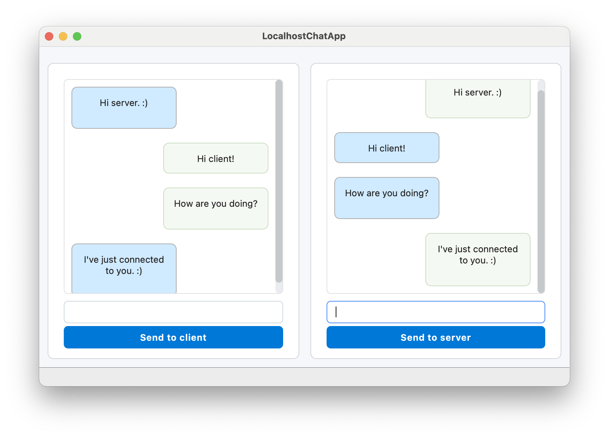

# Localhost Chat App – Qt Desktop Example

This example demonstrates a graphical, bidirectional chat between a **client** and **server** running on the same machine using the **LightweightSecureTCP** library.

- Both client and server run concurrently in a single Qt GUI
- Messages are exchanged instantly and shown in chat bubbles
- Communication is encrypted and structured via handshake protocol

---

---

## ⚙️ Requirements

- Qt 5.15 or Qt 6.5+ (Widgets module)
- Qt Creator with a Desktop Kit (e.g. Qt 6.6.2 GCC 64bit)
- CMake 3.16 or newer
- C++17-compatible compiler
- LightweightSecureTCP included via `add_subdirectory(...)`
 
---

## 🚀 Getting Started

### Using Qt Creator (Recommended)

1. Open `CMakeLists.txt` in **Qt Creator**
2. Configure the project (select a proper **Desktop Kit**)
3. Click the **Build** button (hammer icon)
4. Click the **Run** button (green play icon)

The application will start and establish a secure connection between the client and server running within the same GUI.

---

## 🧠 How It Works

- A `LightweightSecureServer` and a `LightweightSecureClient` are both created inside the application
- The client connects to `127.0.0.1` (localhost)
- A symmetric key handshake is automatically performed
- Messages can be sent from either side using buttons
- Each message appears as a styled chat bubble aligned left (received) or right (sent)

---

## 🎨 Customization

- Change default behavior in `setupServer()` and `setupClient()`
- Edit layout visually with `mainwindow.ui` using Qt Designer
- Adjust colors and padding in `style.qss`

---

## 📦 Technologies Used

- Qt 6 (Widgets + Designer)
- CMake + C++17
- LightweightSecureTCP (custom secure messaging over TCP)
